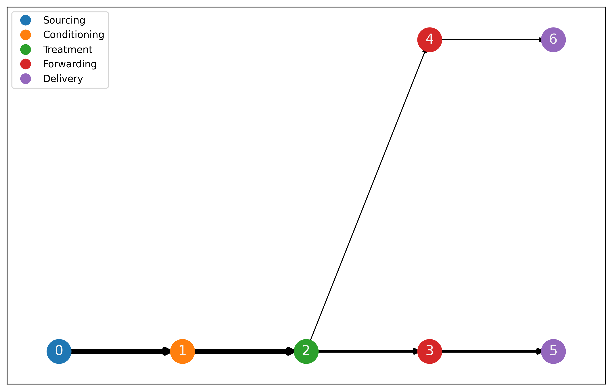

# Network Flow Solutions

This repo contains modeling and visualization solutions for the network flow problems defined in the `NetworkFlowProblem-Data.xslx` file. The solutions are implemented in Python using the [OR-Tools](https://developers.google.com/optimization/) package and the [NetworkX](https://networkx.github.io/) library for path visualization. 

## Model Instructions

### Python Setup
 Both a `requirements.txt` and `environment.yml` file are included in the repo for pip installs in a virtualenv or conda installs, respectively.

#### Pip Install
The code was developed with Python 3.11.3. It may run in other versions of Python but they have not been tested. 

To install the required packages, run the following command in the terminal:

```
pip install -r requirements.txt
```

#### Conda Install 

A `environment.yml` file is included in the repo. To install the required packages, run the following command in the terminal:

```
conda env create --file environment.yml
conda activate networkflow-env
```

### Running the Model
All model code is contained in `analysis/utils.py`. The model can be executed for all inputs by running the following command in the terminal:

```
python analysis/solution.py
```

A `solutions` folder is created that contains a demands csv file and a visualization of the network flow (example below) for each network flow input.




### Model Notebook
An example notebook `Solution.ipynb` is provided that shows model setup and execution for each model input.


## Web Dashboard

A simple web dashboard is also provided to allow users to interact with the model. The dashboard is built using [Dash](https://dash.plotly.com/) and can be run locally by executing the following command in the terminal:

```
python analysis/app.py
```

The dashboard is also hosted on Azure and can be accessed at `http://networkflow.azurewebsites.net/`.
